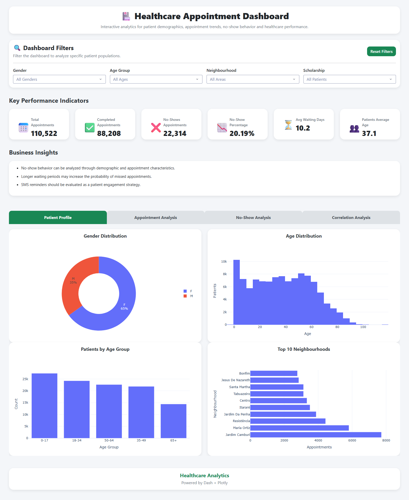

# Healthcare Appointment Analytics Dashboard

An interactive healthcare analytics dashboard developed with **Python**, **Dash**, and **Plotly** to analyze patient appointment behavior and identify factors associated with appointment no-shows.

The project transforms a public healthcare appointment dataset into an interactive business intelligence application featuring KPI monitoring, demographic analysis, appointment trends, no-show analysis, and correlation exploration.

---

## Dashboard Preview

> Add a screenshot after publishing.



---

# Project Overview

Healthcare organizations lose significant time and revenue when patients fail to attend scheduled appointments.

This project analyzes appointment records to answer questions such as:

- What is the overall appointment completion rate?
- What is the no-show rate?
- Which patient groups miss appointments most frequently?
- Does receiving an SMS reminder reduce no-shows?
- Are certain neighborhoods associated with higher no-show rates?
- How long do patients typically wait between scheduling and their appointment?

The dashboard provides an interactive interface for exploring these questions.

---

# Dataset

**Source**

Healthcare Appointment No Shows Dataset (Kaggle)

The dataset contains appointment information including:

- Patient demographics
- Appointment scheduling
- Medical conditions
- SMS reminders
- Attendance status

---

# Technologies Used

- Python
- Dash
- Plotly
- Pandas
- NumPy

---

# Project Structure

```text
healthcare-appointment-analytics-dashboard/

│
├── app.py
├── requirements.txt
├── README.md
│
├── data/
│   └── healthcare_appointments.csv
│
├── assets/
│   └── style.css
│
├── src/
│   ├── data_loader.py
│   ├── kpi.py
│   ├── charts.py
│   ├── layout.py
│   └── callbacks.py
│
└── screenshots/
    └── dashboard.png
```

---
# Application Architecture

The dashboard follows a modular architecture that separates responsibilities across multiple components.

| Module | Responsibility |
|---------|----------------|
| data_loader.py | Loads and prepares the dataset |
| kpi.py | Calculates dashboard KPIs |
| charts.py | Generates Plotly visualizations |
| layout.py | Defines the Dash user interface |
| callbacks.py | Manages interactivity and filtering |
| assets/style.css | Custom dashboard styling |
| app.py | Application entry point |


# Dashboard Layout

The application contains four analytical sections.

## Patient Profile

Analyzes patient demographics.

Visualizations:

- Gender Distribution
- Age Distribution
- Age Groups
- Patients by Neighbourhood

---

## Appointment Analysis

Analyzes appointment scheduling patterns.

Visualizations:

- Appointments by Weekday
- Appointments by Month
- Waiting Days Distribution
- Waiting Days Box Plot

---

## No-Show Analysis

Explores factors influencing missed appointments.

Visualizations:

- No-Show Rate by Gender
- No-Show Rate by Health & Appointment Factors
- No-Show Rate by Neighbourhood

Factors analyzed:

- Scholarship
- Hypertension
- Diabetes
- Alcoholism
- SMS Received

---

## Correlation Analysis

Explores relationships between numerical variables.

Visualization:

- Correlation Heatmap

---

# Key Performance Indicators (KPIs)

The dashboard includes six executive KPIs.

| KPI | Description |
|------|-------------|
| Total Appointments | Total scheduled appointments |
| Completed Appointments | Successfully completed appointments |
| No-Show Appointments | Missed appointments |
| No-Show Rate | Percentage of missed appointments |
| Average Waiting Days | Average delay between scheduling and appointment |
| Average Patient Age | Average age of patients |

---

# Data Preparation

The raw dataset was cleaned and transformed before visualization.

Processing steps included:

- Standardizing column names
- Parsing date columns
- Calculating waiting days
- Creating age groups
- Creating appointment status indicators
- Handling missing values
- Removing duplicate records
- Preparing data for dashboard filtering

---

# Business Insights

The dashboard enables healthcare providers to:

- Monitor appointment attendance
- Identify patient groups with higher no-show rates
- Evaluate the effectiveness of SMS reminders
- Analyze appointment scheduling trends
- Understand demographic distributions
- Support data-driven operational decisions

---

# Skills Demonstrated

- Data Cleaning
- Exploratory Data Analysis (EDA)
- Feature Engineering
- Data Visualization
- Dashboard Development
- Interactive Business Intelligence
- Python Programming
- Dash Application Development
- Plotly Visualization
- Healthcare Analytics

---

# Future Improvements

Potential enhancements include:

- Predictive modeling for no-show risk
- Machine learning classification
- Geographic mapping by neighbourhood
- Doctor-level performance analysis
- Time-series forecasting
- Export dashboard reports

---

# Author

**Therdemis Therasme**

📍 Syracuse, New York, USA

📧 ttherasme@gmail.com

GitHub: https://github.com/ttherasme

LinkedIn: https://linkedin.com/in/ttherasme

---

## License

This project uses a public dataset available for educational and portfolio purposes.
